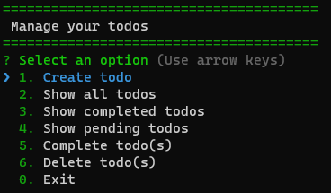

# Manage TODOs console app
Simple console application created with NodeJs to manage TODOs task, lets to list, create, delete and mark as complete tasks saving data in local JSON file to be simple.

### Requirements
This application require only NodeJs installed to run. You can visit [NodeJs](https://nodejs.org/) official page to install according your operative sytem.

### Run application

Once installed NodeJs you can download this project and run the following commands in project folder:
- ```npm install ``` To install all node dependencies
- ```node app ``` To run application

And you can use it:

